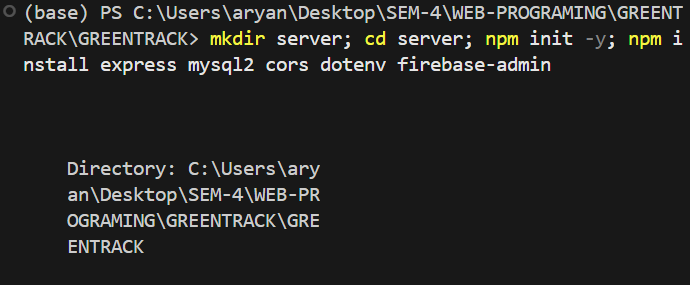
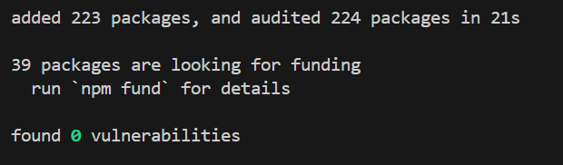
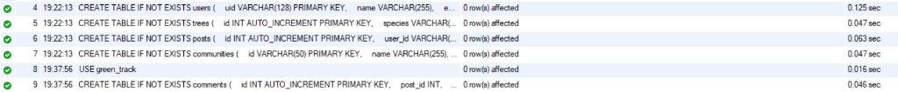
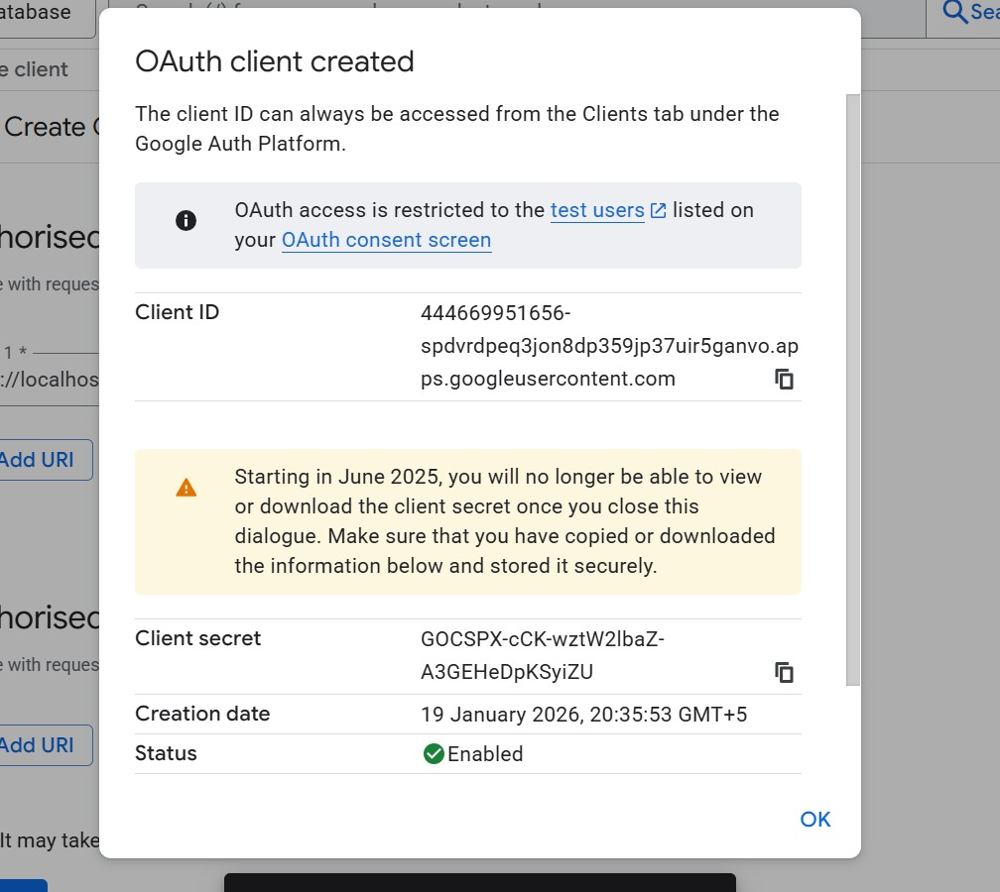
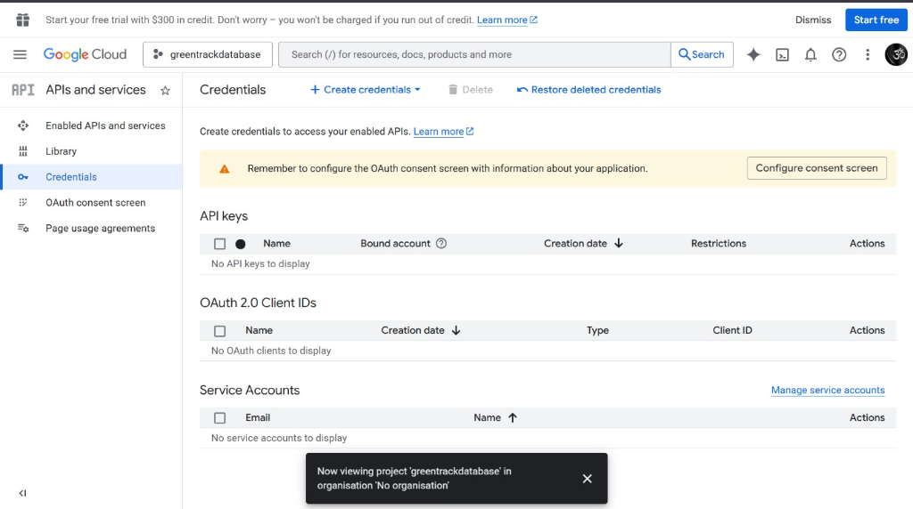
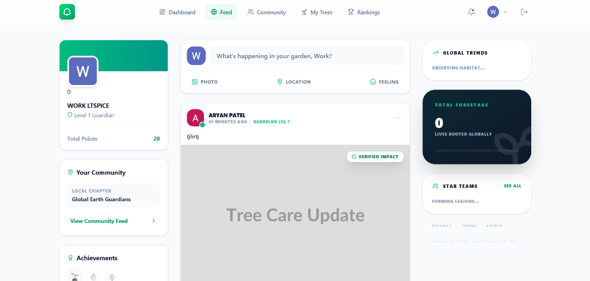
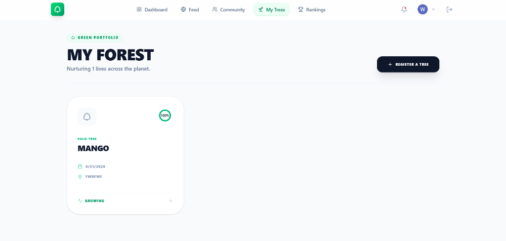
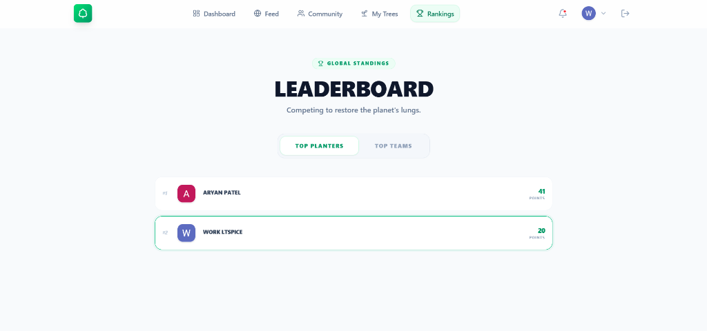
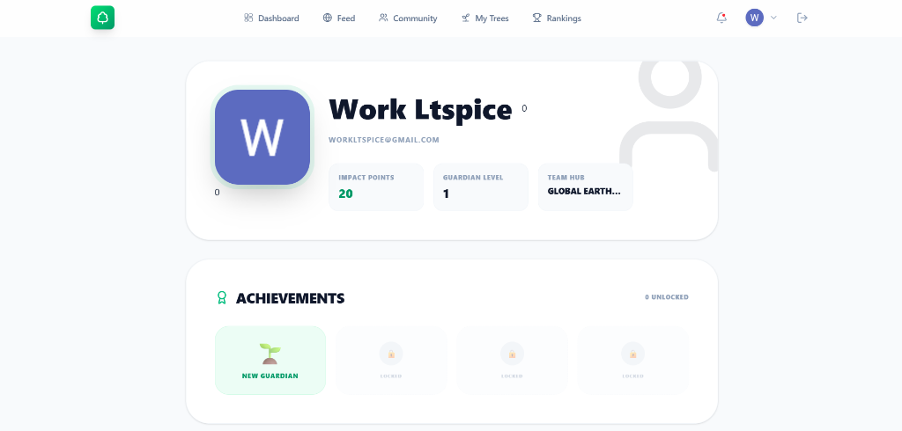

# GreenTrack Project Submission Report

## 1. Project Overview
GreenTrack is a social gamification platform for tree planting, built with React, Node.js, and MySQL. This report documents the database schema, backend logic, and system configuration.

---

## 2. Database Schema (DDL)
The following SQL commands defined in `server/schema.sql` are used to structure the MySQL database.

### Users Table
Stores user profiles, synchronized with Firebase Authentication.
```sql
CREATE TABLE IF NOT EXISTS users (
    uid VARCHAR(128) PRIMARY KEY,
    name VARCHAR(255) UNIQUE, -- Global unique username
    email VARCHAR(255) UNIQUE,
    photo_url TEXT,
    points INT DEFAULT 0,
    level INT DEFAULT 1,
    xp INT DEFAULT 0,
    trees_planted INT DEFAULT 0,
    verified_posts INT DEFAULT 0,
    role VARCHAR(50) DEFAULT 'user',
    community_id VARCHAR(50) DEFAULT 'global',
    community_name VARCHAR(255) DEFAULT 'Global Earth Guardians',
    is_community_leader BOOLEAN DEFAULT FALSE,
    created_at TIMESTAMP DEFAULT CURRENT_TIMESTAMP
);
```

### Trees Table
Stores the inventory of planted trees. Includes a composite unique key to ensure each user has unique tree tags.
```sql
CREATE TABLE IF NOT EXISTS trees (
    id INT AUTO_INCREMENT PRIMARY KEY,
    tree_tag VARCHAR(50) NOT NULL, -- User-defined ID (e.g., GARDEN-01)
    species VARCHAR(255) NOT NULL,
    planted_date DATE,
    location VARCHAR(255),
    caretaker_id VARCHAR(128),
    health_score INT DEFAULT 100,
    created_at TIMESTAMP DEFAULT CURRENT_TIMESTAMP,
    FOREIGN KEY (caretaker_id) REFERENCES users(uid),
    UNIQUE KEY unique_user_tree (caretaker_id, tree_tag) -- Uniqueness Constraint
);
```

### Posts Table
Stores social feed content (images, captions) linked to users and trees.
```sql
CREATE TABLE IF NOT EXISTS posts (
    id INT AUTO_INCREMENT PRIMARY KEY,
    user_id VARCHAR(128),
    user_name VARCHAR(255),
    user_photo TEXT,
    tree_id INT,
    caption TEXT,
    image_url TEXT,
    has_image BOOLEAN DEFAULT FALSE,
    community_id VARCHAR(50),
    location_lat DECIMAL(10, 8),
    location_lng DECIMAL(11, 8),
    status VARCHAR(50) DEFAULT 'verified',
    upvotes_count INT DEFAULT 0,
    created_at TIMESTAMP DEFAULT CURRENT_TIMESTAMP,
    FOREIGN KEY (user_id) REFERENCES users(uid),
    FOREIGN KEY (tree_id) REFERENCES trees(id)
);
```

### Communities & Comments
```sql
CREATE TABLE IF NOT EXISTS communities (
    id VARCHAR(50) PRIMARY KEY,
    name VARCHAR(255),
    leader_id VARCHAR(128),
    -- [Additional Columns Omitted for Brevity]
    FOREIGN KEY (leader_id) REFERENCES users(uid)
);

CREATE TABLE IF NOT EXISTS comments (
    id INT AUTO_INCREMENT PRIMARY KEY,
    post_id INT,
    user_id VARCHAR(128),
    text TEXT NOT NULL,
    created_at TIMESTAMP DEFAULT CURRENT_TIMESTAMP,
    FOREIGN KEY (post_id) REFERENCES posts(id) ON DELETE CASCADE,
    FOREIGN KEY (user_id) REFERENCES users(uid)
);
```

---

## 3. Backend Implementation (API Queries)
Backend logic handled in `server/index.js`.

### User Authentication & Sync
**Logic:** Verifies Firebase token, checks if user exists in MySQL, and creates a record if new.
```javascript
// Check availability
SELECT uid FROM users WHERE name = ?

// Create User
INSERT INTO users (uid, name, email, photo_url, community_id, community_name) VALUES (?, ?, ?, ?, ?, ?)
```

### Tree Registration
**Logic:** Registers a tree and ensures the `tree_tag` is unique for that user. Awards gamification points.
```javascript
// Register Tree
INSERT INTO trees (tree_tag, species, planted_date, location, caretaker_id) VALUES (?, ?, ?, ?, ?)

// Award Points
UPDATE users SET trees_planted = trees_planted + 1, points = points + 20, xp = xp + 20 WHERE uid = ?
```

### Social Mechanics
**Logic:** Handles posting, liking, and commenting.
```javascript
// Create Post
INSERT INTO posts (user_id, ... ) VALUES (?, ... )

// Like Post
UPDATE posts SET upvotes_count = upvotes_count + 1 WHERE id = ?
UPDATE users SET points = points + 1 WHERE uid = ? // Reward author

// Fetch Feed
SELECT * FROM posts WHERE tree_id = ? AND community_id = ? ORDER BY created_at DESC LIMIT 50
```

---

## 4. Entity-Relationship (ER) Diagram
<!-- 
    PASTE YOUR HAND-DRAWN ER DIAGRAM HERE 
    You can replace this text block with your scanned image or drawing.
-->
<div style="width: 100%; height: 400px; border: 2px dashed #ccc; display: flex; align-items: center; justify-content: center; background-color: #f9f9f9; color: #888;">
    [ INSERT HAND-MADE ER DIAGRAM HERE ]
</div>

---

## 5. System Configuration & Setup Screenshots

### Environment Setup
Initializing the Node.js server and installing dependencies (`express`, `mysql2`, `firebase-admin`).


### Package Installation
Successful installation of backend packages.


### Database Creation
Executing `CREATE TABLE` commands in the MySQL CLI to verify schema creation.


### Google OAuth Configuration
Setting up the OAuth client ID for Firebase Authentication.


### Google Cloud Credentials
Overview of active API credentials for the project.


---

## 6. Application Interface
Screenshots of the live, responsive GreenTrack application.

### Live Feed Dashboard
The central hub for community activity, showing real-time posts from global guardians.


### My Forest Inventory
A personalized view of the user's planted trees, displaying growth status and unique Tree IDs.


### Global Leaderboard
Rankings of top planters and community teams, fostering healthy competition.


### User Profile & Achievements
Comprehensive user stats, showing total impact, guardian level, and unlocked badges.

